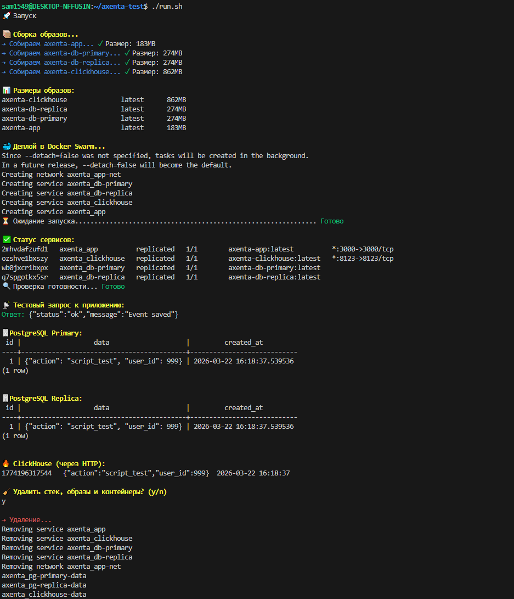

# Инфраструктура для сбора событий: Node.js + PostgreSQL (Primary + Replica) + ClickHouse.


## 🚀 Быстрый запуск

```bash
# 1. Инициализировать Swarm (один раз)
docker swarm init

# 2. Запустить всё
chmod +x run.sh
./run.sh
```

Скрипт сам соберёт образы, задеплоит и покажет данные из БД.



---


## 📋 Ручной запуск

```bash
# Сборка образов
docker build -t axenta-app ./app
docker build -t axenta-db-primary ./db/primary
docker build -t axenta-db-replica ./db/replica
docker build -t axenta-clickhouse ./clickhouse

# Деплой
docker stack deploy -c swarm/docker-stack.yml axenta


# Проверка
docker service ls
```

---

## ✅ Проверка работы

```bash
# Отправить событие
curl -X POST http://localhost:3000/event \
  -H "Content-Type: application/json" \
  -d '{"action": "test", "user_id": 1549}'

# Health check
curl http://localhost:3000/health
```

---

## 🗄️ Проверка данных

### PostgreSQL Primary
```bash
docker exec -it $(docker ps -q --filter name=axenta_db-primary) \
  psql -U postgres -d eventsdb -c "SELECT * FROM events ORDER BY id DESC LIMIT 5;"
```

### PostgreSQL Replica
```bash
docker exec -it $(docker ps -q --filter name=axenta_db-replica) \
  psql -U postgres -d eventsdb -c "SELECT * FROM events ORDER BY id DESC LIMIT 5;"
```

### ClickHouse
```bash
# Через HTTP
curl 'http://localhost:8123/?query=SELECT * FROM events ORDER BY id DESC LIMIT 5&user=default&password=clickhouse_secret'

# Через CLI
docker exec -it $(docker ps -q --filter name=axenta_clickhouse) \
  clickhouse-client --password clickhouse_secret --query "SELECT * FROM events ORDER BY id DESC LIMIT 5"
```

---

## 📁 Структура

```
axenta-test-task/
├── run.sh              # Запуск всего
├── app/                # Node.js приложение
├── db/primary/         # PostgreSQL Primary
├── db/replica/         # PostgreSQL Replica
├── clickhouse/         # ClickHouse
└── swarm/
    └── docker-stack.yml # Манифест
```


## 🎯 Что работает

- ✅ Docker Swarm с overlay network
- ✅ PostgreSQL Primary + Replica 
- ✅ ClickHouse 
- ✅ JSONB для событий
- ✅ Healthcheck для всех сервисов
- ✅ Порты БД закрыты снаружи

---

## 🔐 Пароли и доступы

| Сервис | Пользователь | Пароль | Назначение |
|--------|-------------|--------|------------|
| PostgreSQL | `postgres` | `secret_password` | Основной доступ к БД |
| PostgreSQL | `replicator` | `replication_secret` | Репликация между узлами |
| ClickHouse | `default` | `clickhouse_secret` | Доступ к ClickHouse |

---

